# Slopewatch

**Daily landslide risk for the Indian Himalaya, on an 11 km grid, from rainfall and terrain.**

`SIH 2026 · PS 26192` — flash flood and landslide early warning

13 scripts · 12 modules · 11 warehouse tables · 8 views and marts · 41 features · 18 tests · 24 verification checks

---

## The problem is the base rate

Across the study area there is roughly **one landslide per 48,000 cell-days**. Every design decision in this project follows from that single number.

Ten years of daily observations across 22,594 mountain cells is about 82 million cell-days, and the catalogue records 1,719 events inside them. Two things follow immediately, and both are traps a conventional approach walks straight into.

**Accuracy becomes a lie.** A model that predicts "no landslide" everywhere, every day, is 99.998% accurate. That number does not merely fail to inform — it actively conceals total failure. `src/model/metrics.py` therefore never computes it.

**A gridded panel becomes untrainable.** Materialising every cell-day would mean 82 million rows of which 0.002% are positive, each needing a 45-day weather history fetched over an API allowing 10,000 calls a day. Acquisition alone would take centuries.

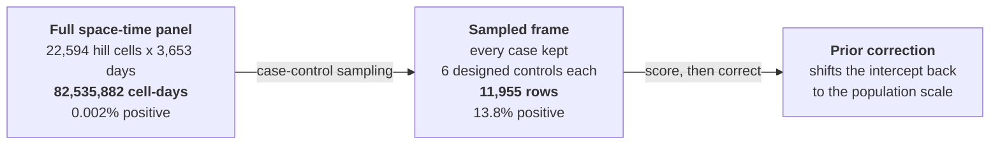

Case-control sampling buys tractability at the cost of a deliberately wrong base rate. That distortion is exactly recoverable — the prior correction subtracts a known log-odds offset — but only if it is remembered. Every score this system publishes carries both numbers.

---

## Result

| | test split |
|---|---|
| PR-AUC | **0.244** [0.214 – 0.280] |
| base rate (sampled) | 0.168 |
| **lift over base rate** | **1.45x** |
| recall @ 5% inspection budget | 0.130 |
| recall @ 10% | 0.287 |
| recall @ 20% | 0.460 |
| ROC-AUC | 0.647 |
| Brier | 0.139 |
| mean held-out-region PR-AUC | 0.259 |
| calibration error | 0.060 mean abs. gap |

Trained on **8,837 rows / 41 features** at 74% weather coverage. Events per variable: 23.

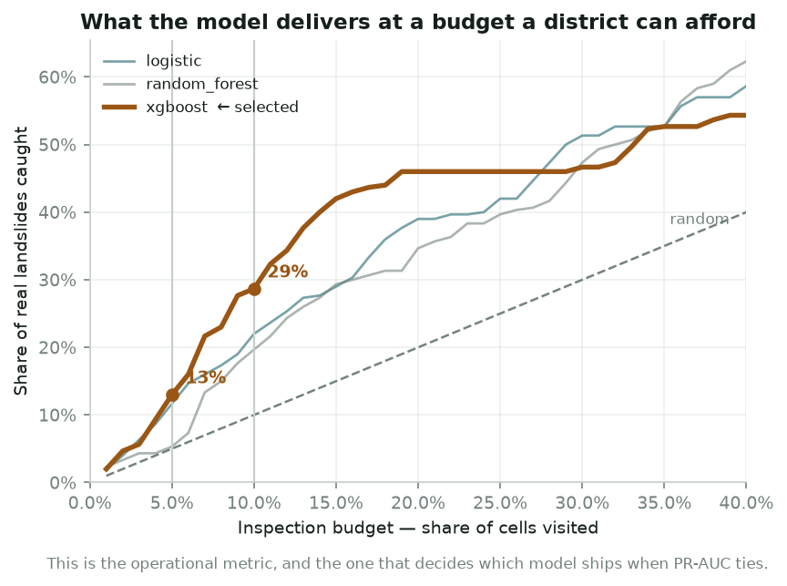

**This is the figure to read.** PR-AUC is the honest headline, but it is not an operational quantity. *Recall at budget* is: if a district can inspect its top 5% of cells today, it reaches 13% of real landslides; at 10%, nearly 29%. Whether that is useful depends entirely on what inspecting a cell costs — a question for the district, not the model.

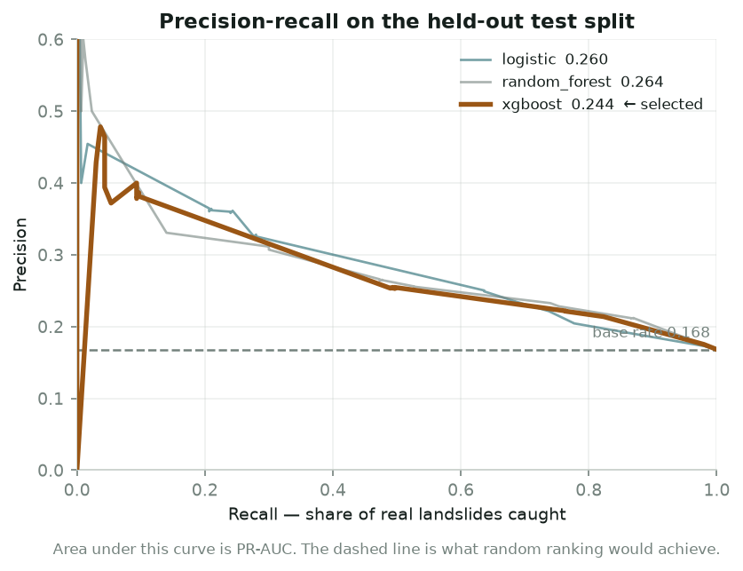

### Which model, and why

All three candidates **tie** on PR-AUC — the bootstrap intervals overlap almost completely, so the 0.004 separating first from second is noise. Recall at budget is not noise.

| model | PR-AUC | 95% CI | recall @5% | recall @10% | Brier |
|---|---|---|---|---|---|
| random forest | 0.2639 | 0.231 – 0.300 | 0.053 | 0.197 | 0.136 |
| logistic | 0.2604 | 0.229 – 0.302 | 0.117 | 0.220 | 0.137 |
| **XGBoost** — selected | 0.2444 | 0.214 – 0.280 | **0.130** | **0.287** | 0.139 |

Sorting on PR-AUC alone would ship the model that catches *less than half* as many landslides at a budget anyone could afford. So models whose interval overlaps the leader's are treated as tied, and the tie breaks on recall at 5%. The rule validates itself first: if validation and test disagreed about the winner, the PR-AUC leader would be kept, because a tie-break that only holds on the split it was measured on is tuning. They agreed — XGBoost leads on validation too (0.177).

> **Do not compare this PR-AUC to an earlier one.** A run at 20% weather coverage reported 0.410 against a base rate of 0.267. This reports 0.244 against 0.168. The **lift** moved 1.54x to 1.45x, and everything base-rate independent *improved*: Brier 0.184 to 0.139, calibration 0.065 to 0.060, recall@10% 0.203 to 0.287. The headline fell because the base rate fell with it. This is precisely the mistake the bootstrap intervals exist to prevent.

---

## The elevation confounder

**The most important thing this project found, it found in its own sampler.**

An early model put `elev_mean` at the top of the SHAP ranking with **twice the weight of any other feature**. Elevation is a plausible landslide predictor, so the ranking was not obviously absurd. The magnitude was: rainfall should dominate, and it did not.

The cause was the hill mask, one pipeline stage removed. `slope_mean >= 5°` admits the whole Ladakh and Tibetan plateau — high, cold, arid, outside the monsoon, and comfortably steep. Background controls drawn uniformly from that mask had a median elevation of **4,479 m against 1,433 m for cases**. The model was separating a plateau from a slope. A real distinction, and an entirely different question from the one being asked.

| | before the fix | after the fix |
|---|---|---|
| case median elevation | 1,433 m | 1,433 m |
| control median elevation | **4,479 m** | **1,416 m** |
| gap | +3,046 m | **−17 m** |
| top SHAP feature | `elev_mean` **0.513** | `rain_1d` 0.212 |
| runner-up | `rain_max_1d_in_7` 0.221 | `rain_3d` 0.182 |
| `elev_mean` rank | **1** | not in the top 15 |

The fix is in the **sampler**, not the mask. `dim_cell.is_hill` still flags the plateau — correctly, it *is* steep. What changed is that background and spatial controls are now drawn from the elevation band of the case they were built around: 500 m bands, ±1 band tolerance, anchoring on a case cell *first*.

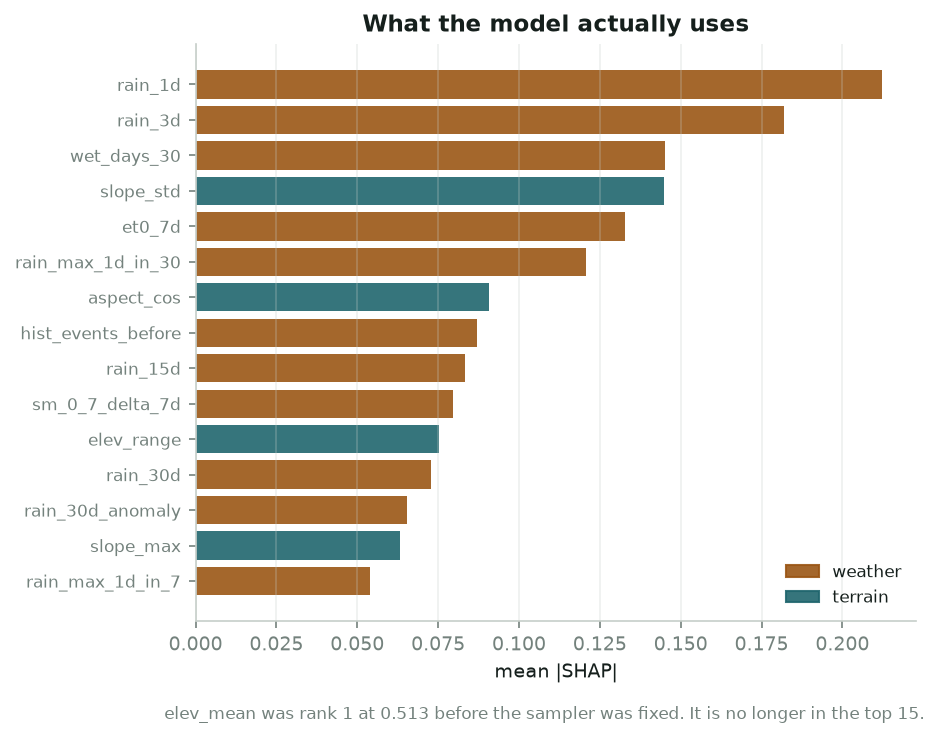

Rainfall first — the day itself, then the three-day accumulation, then how many wet days preceded it. Terrain enters fourth as **roughness**, not altitude. That ordering is what the landslide literature describes, and it emerged from a sampling fix rather than any change to the model.

**A regression test pins it.** `tests/test_sampling.py` builds a synthetic world where plateau cells at 4,500 m and slope cells at 1,400 m are *interleaved in space*, so the 25–300 km spatial annulus cannot separate them by accident. Only band matching can pass.

---

## How it works

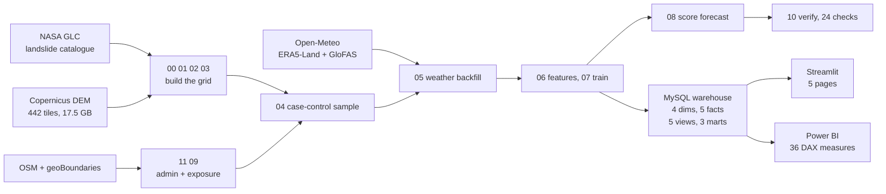

### Stage order is not arbitrary

Stages **11 and 09 jump the numeric queue** and run before 04, because the sampler needs the hill mask and the region labels they write. The dependency graph decides, not the filename.

| stage | script | what it does | typical minutes |
|---|---|---|---|
| 00 | `00_init_db.py` | schema, `dim_date`, 40,800-cell grid | <1 |
| 01 | `01_load_landslides.py` | NASA catalogue to `fact_landslide` | <1 |
| 02 | `02_download_dem.py` | 442 Copernicus DEM tiles, 17.5 GB | 20–40 |
| 03 | `03_build_terrain.py` | slope, aspect, ruggedness, hill mask | 30–45 |
| 11 | `11_label_admin.py` | state and district names | 2–5 |
| 09 | `09_build_exposure.py` | OSM roads, settlements, facilities | 5–15 |
| 04 | `04_build_sample.py` | case-control sample to `fact_sample` | 1–3 |
| 05 | `05_fetch_weather.py` | Open-Meteo windows to `fact_weather_daily` | 30–240 |
| 06 | `06_build_features.py` | feature matrix + leakage audit | 1–3 |
| 07 | `07_train_model.py` | train, calibrate, blocked validation | 5–20 |
| 08 | `08_score.py` | forecast scoring to `fact_risk_pred` | 3–10 |
| 10 | `10_verify.py` | end-to-end verification | <1 |
| 13 | `13_learning_curve.py` | how much more data is worth | 1–2 |
| 14 | `14_report_figures.py` | the figures in this README | <1 |

---

## The grid

Everything is keyed to a 0.1° lattice over 21.5–37.5°N, 72.0–97.5°E — 160 rows x 255 columns, **40,800 cells**, each roughly 11 km on a side.

Two independent arguments converge on 0.1°. The catalogue records most event positions to within **5–25 km**, so a finer lattice "would produce confident predictions the labels cannot support". And 0.1° is ERA5-Land's native resolution, so one grid cell maps to exactly one weather pixel with no resampling. Resolution is set by the *worse* of the label and the predictor.

Cell identity is a positional encoding — `cell_id = lat_idx * 1000 + lon_idx` — deterministic, so a reload never reshuffles keys, and exactly invertible by `divmod`.

> **Trap.** `N_LON_CELLS` is computed with `round()`, not integer division. `(97.5 - 72.0) / 0.1` evaluates to **254.99999999999997** in IEEE-754. Refactoring that to `int()` or `//` would silently drop an entire column of 160 cells — no error, no warning.

The study area is a **bounding box, not a list of state names**, and the reason is a data defect: the catalogue stores `Nagaland` and `Nāgāland` as separate values. Matching by name undercounts that state by 82%.

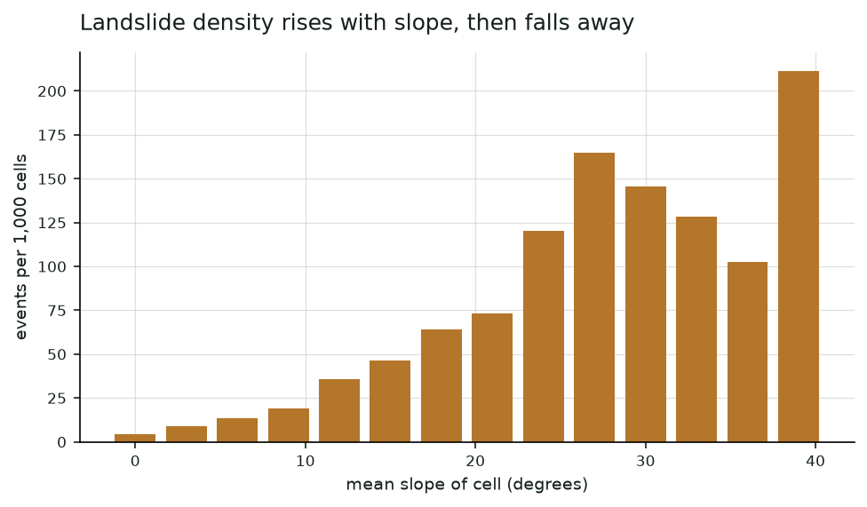

---

## The catalogue


India 1,017 · Nepal 481 · Pakistan 118 · Bangladesh 42 · Myanmar 23 · Bhutan 20 · China 18

973 distinct cells · **89.4% rainfall-triggered** · median location error 10 km

**Training spans the whole Himalayan orogen; evaluation is India only.** Full-arc training nearly doubles the sample — 1,781 against 1,017 — and the added events share the same geology and monsoon regime, so the physics transfers.

> **Excel silently rewrote the dates.** A duplicate of the catalogue sits in `dataset/`. Opening it in Excel and saving converted the 4,395 rows whose day component is <=12 into `DD-MM-YYYY`, leaving the other 6,638 as `MM/DD/YYYY`. Parsing that file under *either* convention misdates **4,083 events**. The pipeline reads only `data/raw/global_landslide_catalog.csv`.

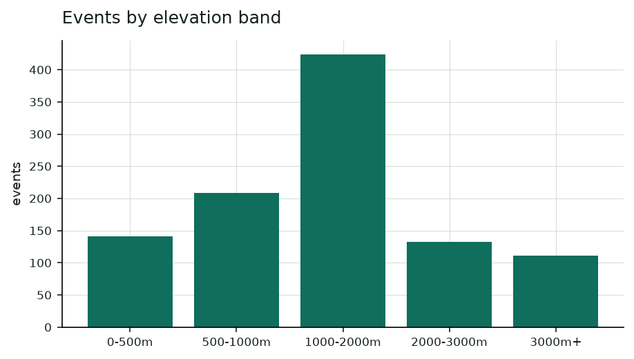

---

## The sampling design

Every event becomes a case; six controls are drawn around each, in three strata that each neutralise a specific confound.

A single undifferentiated pool of random negatives would let the model win on the wrong question. Draw a random cell-day and it is probably flat, dry, and in January. Separating those from monsoon landslides in the Himalaya is learning "mountain in July versus plain in winter" — true, and useless.

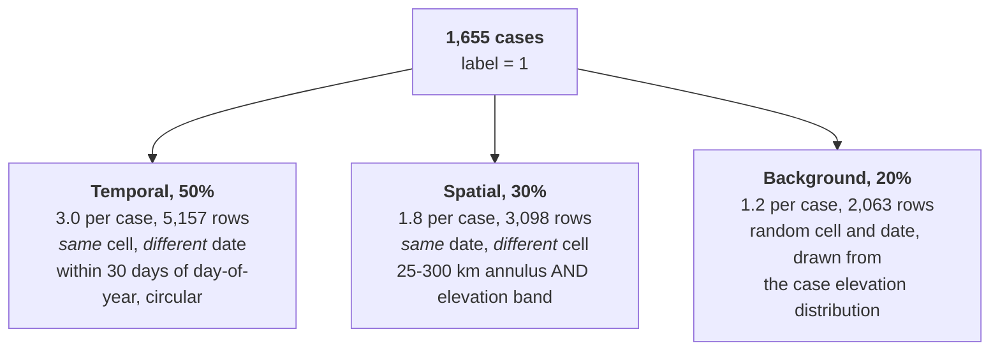

| stratum | asks |
|---|---|
| **Temporal** | *why did **this** monsoon day fail when hundreds of others in the same cell did not?* |
| **Spatial** | *the storm hit both — why did only one slope go?* |
| **Background** | *what does an ordinary day on this kind of slope look like?* |

**The exclusion buffer.** A candidate negative within **15 km and ±2 days** of a recorded event is *discarded*, never labelled zero. The catalogue records *reported* landslides, and in remote terrain many go unreported. A cell 8 km from a confirmed slide on the same day may well have failed too — teaching the model it did not is teaching it a falsehood. 46,234 cell-date pairs sit inside that buffer, and the spatial annulus starts at 25 km precisely so the two rules cannot contradict each other.

**Splits are blocked, never random.** Train <= 2013 · validation 2014 · test 2015–16, with leave-one-region-out layered on top across four blocks. A random split would let a 2015 row train while its 2016 neighbour is tested; weather is autocorrelated over days and terrain is constant per cell, so the model scores beautifully by recognising cells it has already seen. The failure is silent.

Kashmir is grouped with Himachal rather than pooled east: only **47% of its events fall in the monsoon** against 85–93% elsewhere, because it is driven by western disturbances and snowmelt.

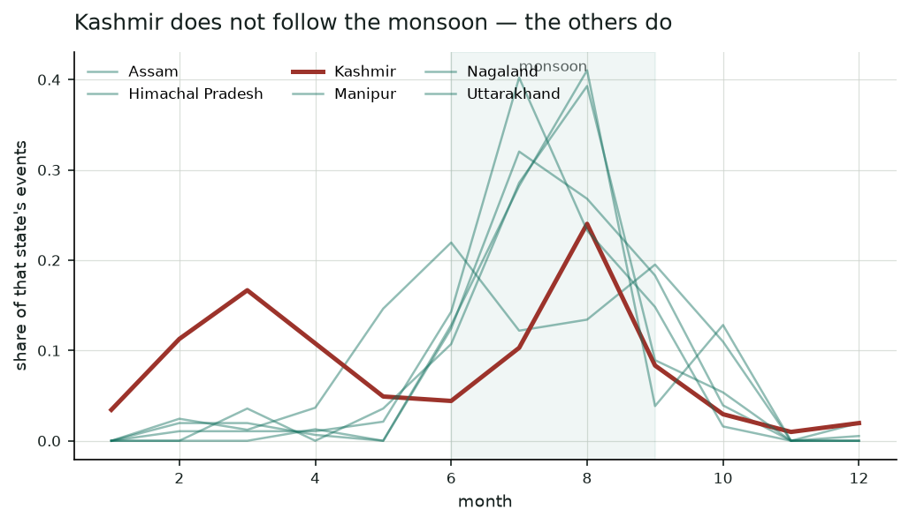

---

## Weather acquisition — the long pole

Each of 11,955 samples needs its own 45-day window. The free tier allows ~10,000 calls a day against a total need of roughly **38,000**.

Open-Meteo bills fractionally: a 45-day window over 10 variables costs `max(1, 45/14) * max(1, 10/10) ~= 3.21` units **per coordinate**. That per-coordinate figure was *measured*, not assumed — batching eight locations per request, the quota ran out after 1,385 windows, which is 1,385 x 3.2 x 2 ~= 8,900 units. Batching saves round trips and nothing else.

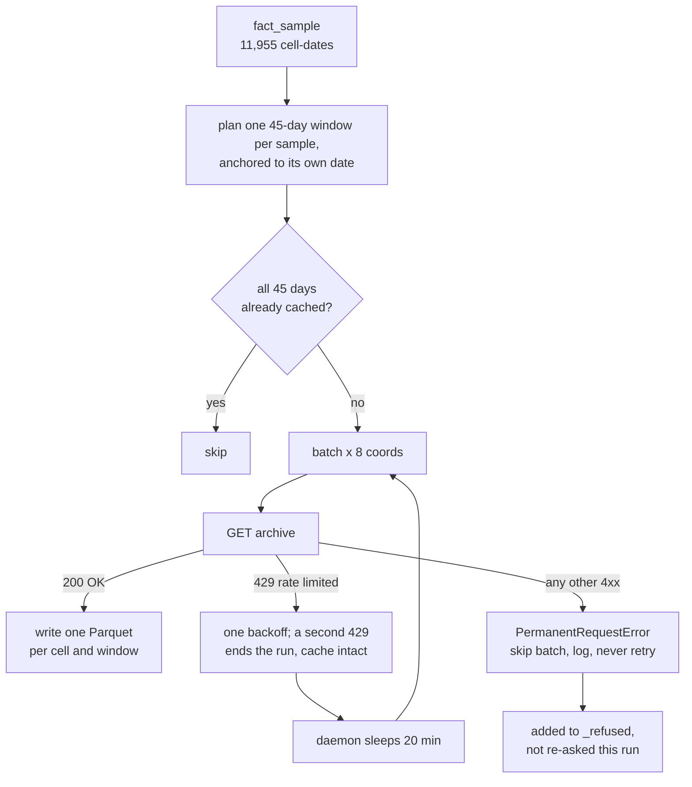

**Why 429 and 400 must be handled differently:** a 429 is a statement about the *moment* and waiting fixes it. A 400 is a statement about the *request* — a window ERA5 has not reanalysed yet — and no amount of backoff will change the answer. Conflating them killed a backfill once.

**The cache is keyed on coverage, not filenames.** `pending()` builds an index of `cell_id -> {date_id}` across every file on disk and drops a window only when every day it needs is present *somewhere*. The days do not care which file they arrived in.

---

## Features

**41 model inputs** in three families, computed by one module that both training and scoring call. That shared path is deliberate — training/serving skew is the most common way a system like this rots, and it fails silently.

| family | count | features |
|---|---|---|
| **Dynamic** — what the sky and soil have done | 24 | `rain_{1,3,7,15,30}d` · `rain_max_1d_in_{7,30}` · `wet_days_{7,30}` · `api` · `sm_{0_7,7_28,28_100}` each with `_delta_1d`, `_delta_7d`, `_mean_7d` · `et0_7d` · `wetness_ratio_7d` · `temp_mean_7d` · `rain_{7,30}d_anomaly` |
| **Static** — which cells can fail at all | 8 | `elev_mean` · `elev_range` · `slope_mean` · `slope_max` · `slope_std` · `aspect_sin` · `aspect_cos` · `tri` |
| **Contextual** — calendar and the cell's own past | 9 | `month` · `doy_sin` · `doy_cos` · `is_monsoon` · `hist_events_before` · `has_prior_event` |

The **antecedent precipitation index** — `API_t = precip_t + 0.92 * API_(t-1)` — is a single number standing in for "how wet is this slope right now", weighting recent rain more heavily without the hard cutoff a fixed window imposes.

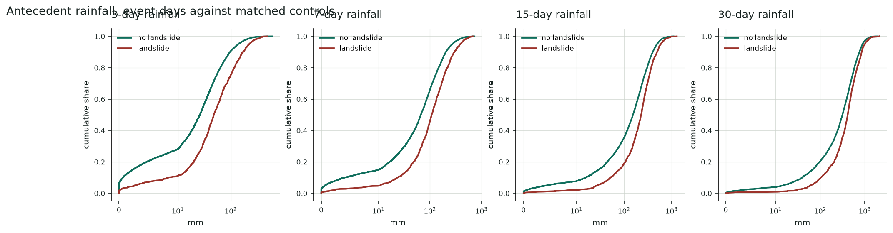

**Two features had to be redesigned.** `wetness_ratio_7d` began as rainfall *minus* evapotranspiration; ET0 varies far less than rainfall, so the difference correlated with `rain_7d` at **1.00** and carried nothing new. A ratio is scale-free and does separate. `rain_7d_anomaly` exists because 200 mm in Cherrapunji and 200 mm in Leh are not the same event.

**Deliberately excluded:** `discharge` and `discharge_ratio`. GloFAS models river reaches; most landslide cells are headwater slopes reading near zero. Fetching it also doubles API cost — and a feature whose presence correlates with fetch order is a leak, not a feature.

**The leakage audit** refuses to hand over a matrix it has not checked:

```
top correlations with the label:
   rain_3d            0.207      rain_7d           0.183
   rain_1d            0.178      wetness_ratio_7d  0.171
cases with a prior event in the same cell: 41.6%
leakage audit passed
```

All rainfall and soil moisture, none above 0.25. `hist_events_before` is counted **strictly before** each sample date — a catalogue total would hand the model the answer.

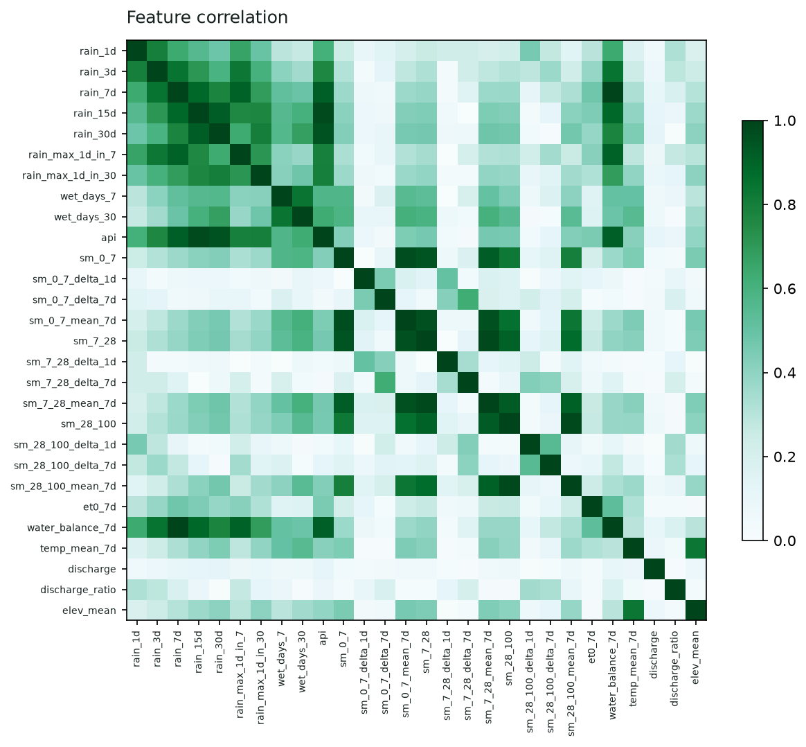

---

## Does it generalise?

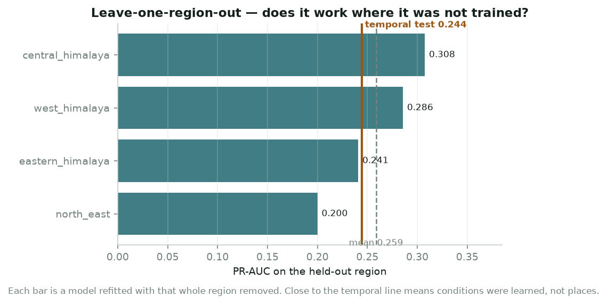

Mean held-out-region **0.259** against a temporal-test 0.244 — spatial generalisation is marginally *better* than temporal, where at 20% coverage it was 0.030 worse. Performance does not collapse on terrain the model has never seen.

### Calibration

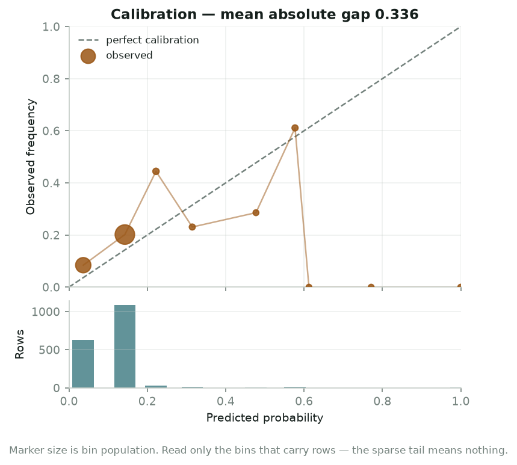

Mean absolute gap **0.060**. The two bins carrying almost all the mass — 1,714 of 1,784 rows — track observed frequency closely. The sparse tail is reported rather than quietly dropped.

### Score separation

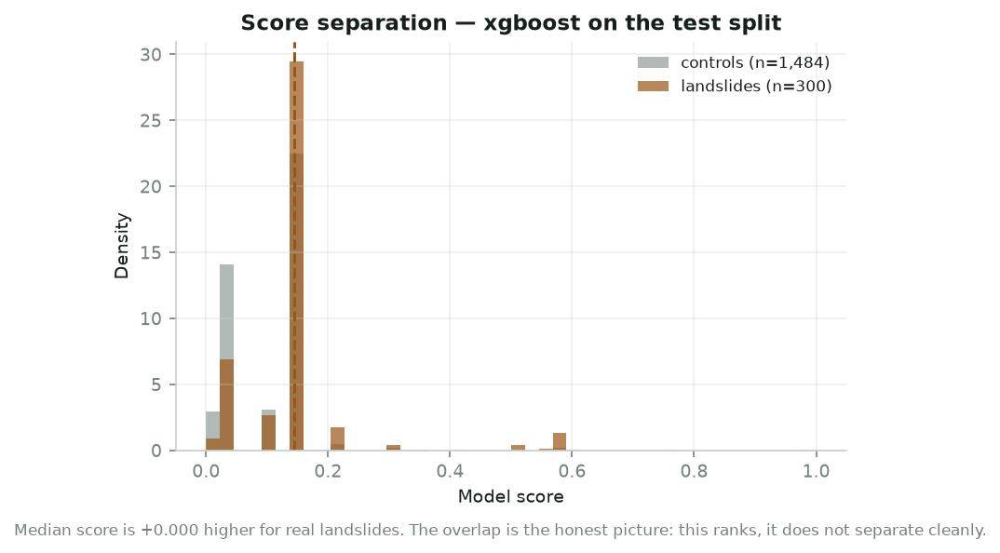

The overlap is the honest picture: this **ranks**, it does not separate cleanly. A screening aid, not a detector.

---

## Honesty instrumentation

Four devices exist specifically to make it harder to lie by accident.

- **Accuracy is absent by design.** At the sampled ratio a "safe everywhere" model scores 83%; on the real grid, 99.998%.
- **Recall at budget leads.** PR-AUC is the headline; recall at a 5% budget is the number a district can act on.
- **Every PR-AUC carries a bootstrap interval.** The test split grows as the backfill lands, so two successive runs are *not* measured on the same data.
- **The operating threshold is stated, not defaulted.** False negatives cost lives, false positives cost an inspection vehicle — the threshold minimises expected cost at **20:1** rather than sitting at 0.5.

---

## Scoring — one score, three questions

The model's output is **not a probability of failure and must not be presented as one**. It was trained where roughly one row in six is a landslide; the real world is closer to one cell-day in fifty thousand.

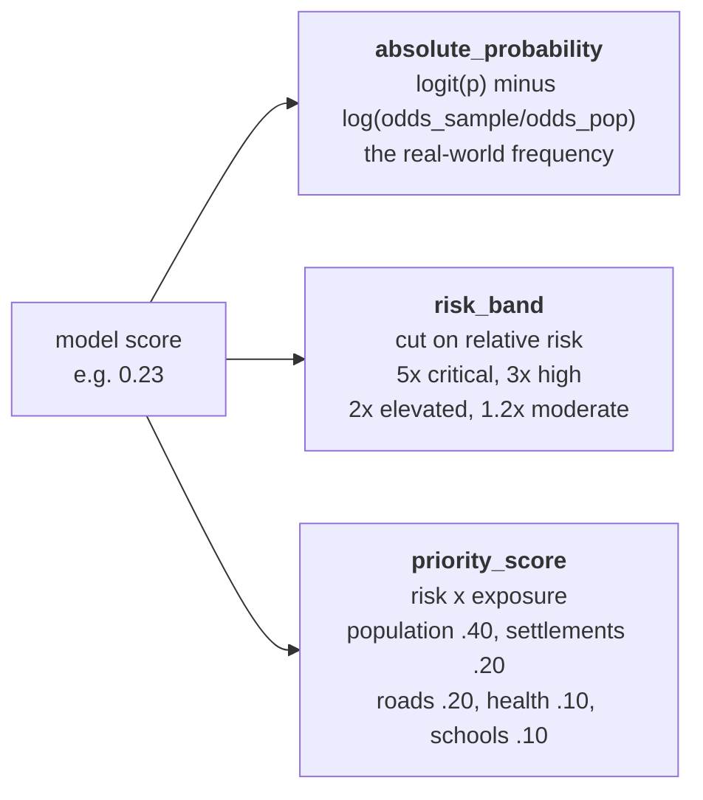

Bands are cut on **relative risk**, not the raw score. A model calibrated against a 15% base rate produces scores centred near 0.15, so a "critical at 0.80" rule would never fire and the whole map would read *low* straight through a monsoon. 5x also carries the meaning an officer needs: five times the background rate.

> A cell above a road outranks a riskier one in empty forest. Exposure raises priority but never zeroes it. Exposure is **not** a model input — it is joined downstream for dispatch.

---

## The warehouse

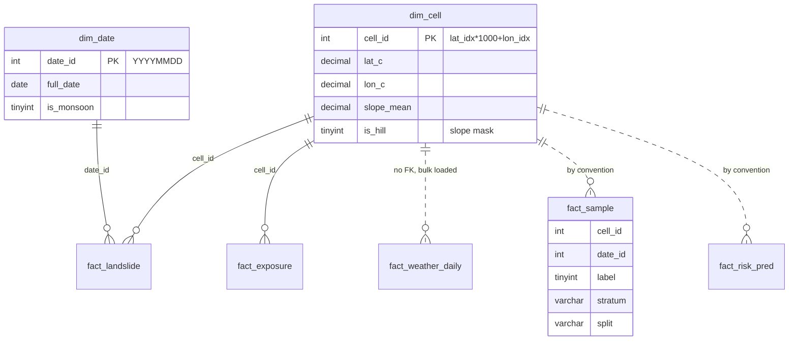

**4 dimensions, 5 facts, 1 run log**, plus **5 views and 3 marts**. Every rolling window, ranking and cohort is a SQL window function rather than pandas code — so the model and the Power BI report consume exactly the same definitions.

**No geometry columns anywhere.** Distance work is a one-time GeoPandas precompute landed in `fact_exposure`, which avoids the SRID 4326 axis-order trap and keeps the schema portable.

---

## The application

```bash
.venv/Scripts/streamlit run app/streamlit_app.py
```

Power BI serves the authority-facing command centre; Streamlit covers what it cannot — the field officer and citizen side.

| page | what it shows |
|---|---|
| **Risk map** | Scored cells on a map, filtered by band, with the highest-priority list ranked by risk x exposure |
| **Cell detail** | One cell: score, band, real 1-in-N frequency, terrain, exposed settlements, SHAP drivers in plain language, and the score across the forecast window |
| **Model** | Headline metrics, all six figures from this README, model comparison, and an explicit statement of what the model is not |
| **Field report** | Geo-tagged reporting of cracks, slope movement and blocked roads — **queued locally first**, so an officer standing on a severed road can still file one |
| **History** | Events, deaths and seasonality from the catalogue the model learned from |

Power BI measures live in `powerbi/measures.dax` — 36 measures across six groups. Two carry reasoning worth repeating:

> *Exposure is only counted where risk is actually elevated. Summing population across every scored cell would report the population of the Himalaya, which is true and useless.*

> *Sum, not average. A district with one critical cell and forty quiet ones needs a team; its average would hide that entirely.*

---

## Verification and tests

```bash
.venv/Scripts/python.exe scripts/10_verify.py
.venv/Scripts/python.exe -m pytest
```

**24 checks in five groups**, printing a single verdict:

| group | checks | asserts |
|---|---|---|
| Completeness | 7 | row-count minimums; hill mask covers 5–80% of the grid |
| Integrity | 7 | foreign keys resolve; sample uniqueness; rainfall 0–2000 mm; soil moisture 0–1; slope 0–90°; highest point 8,000–9,000 m |
| Leakage | 3 | no feature above the correlation ceiling; prior-event share plausible; temporal split does not run backwards |
| Honesty | 4 | test PR-AUC, recall@5%, held-out-region PR-AUC, calibration error |
| Predictions | 3 | predictions exist; probabilities in [0,1]; critical share not absurd |

```
24 checks: 23 passed, 1 warnings, 0 failed
  ! WARN   recall at 5% budget    0.130
```

The warning is honest rather than broken — the verifier states the limitation every run rather than letting it pass unremarked.

**18 tests** pin the failures that actually happened here rather than chasing a coverage number: the elevation confounder cannot silently return; a permanent HTTP 400 costs one batch not the run; cache windows stay anchored to their own sample; no sample or weather row may be dated outside the study window.

---

## Five real failures

Every one shipped silently for a while. Recorded because the fixes are only trustworthy if the failures are stated.

| # | Failure | Cost | Fix |
|---|---|---|---|
| 1 | **Elevation confounder** — controls at 4,479 m against cases at 1,433 m | `elev_mean` became the top SHAP feature at twice anything else | elevation-band matching, pinned by a regression test |
| 2 | **Moving cache windows** — merged per cell, so boundaries shifted whenever sampled dates changed | 2,190 fetched windows, **232 survived** | one window anchored per sample; `pending()` checks day coverage, not filenames |
| 3 | **Forecast dates leaked into training** — `08_score.py` extends `dim_date`, and unbounded readers inherited it | 18 samples dated 2026; a permanent HTTP 400 killed a run with 10,000 good windows left | both readers bounded to the study window; non-429 4xx skips its batch |
| 4 | **Excel rewrote the catalogue dates** | 4,083 events would be misdated under either convention | the pipeline reads only the canonical CSV |
| 5 | **Capacity gate measured the wrong thing** — reaching 941 positives crossed `n_positives < 500` | both trees became lookup tables: random forest 0.934 train / 0.241 val, XGBoost 0.991 / 0.214 | the gate now measures **events per variable**; both improved on held-out data once tightened |

---

## How much data is enough?

Measured, not asserted. `scripts/13_learning_curve.py` subsamples the training split and holds the test split fixed.

```
 frac   rows   pos   EPV   test pr_auc
 0.25   1567   235   5.7   0.260 +- 0.009
 0.40   2507   376   9.2   0.271 +- 0.010
 0.55   3448   518  12.6   0.282 +- 0.009
 0.70   4389   659  16.1   0.288 +- 0.008
 0.85   5329   800  19.5   0.292 +- 0.006
 1.00   6269   941  23.0   0.291
```

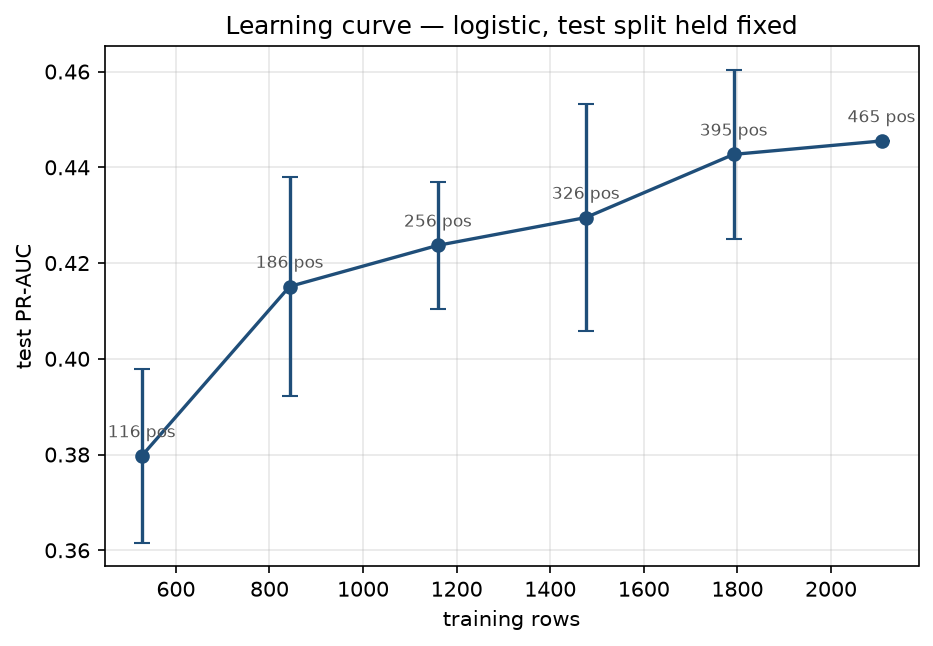

Quadrupling the training rows bought **+0.031**. The last 1.4x bought +0.003, and the final step is *negative*. **The curve has stopped climbing.**

This is the second measurement. The first, on a 2,941-row matrix at 20% coverage, extrapolated that another 4x would buy +0.02 to +0.04. The actual 3x bought +0.031. An extrapolation that survives its own test is worth more than the point estimate it was made from.

Sample size is no longer the binding constraint — **predictor resolution is**.

---

## Limitations

**Daily sums cannot see the trigger.** The largest cap, and a data limit rather than a model limit. Landslides respond to sub-daily rainfall *intensity*; the model sees `precipitation_sum`, a 24-hour total. A three-hour cloudburst and a day of drizzle can be the same number here and are completely different on a hillside.

Be precise about *which axis* is missing. The intensity-duration gate **passes** on this data — median intensity falls from 16 mm/day at 3 days to 15 at 15 days, the decreasing power law the literature reports, and antecedent rainfall separates at 108 mm before an event against 66 mm for controls. So the data resolves *duration* and antecedent build-up. What it cannot resolve is the sub-daily burst that tips an already-saturated slope.

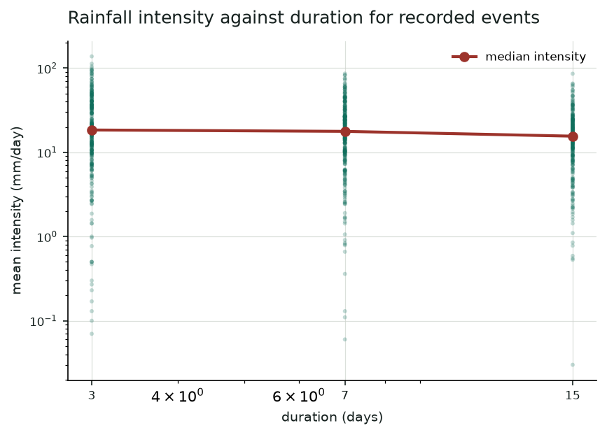

**11 km cells against 1–2 km orographic rainfall.** The grid matches ERA5-Land's native resolution, so there is no false precision — but the predictor frequently does not see the rain that caused the slide.

**Reporting bias in the labels.** The catalogue records *reported* landslides. Absence of a record is not absence of a landslide. The exclusion buffer mitigates this; nothing removes it.

**Not an operational warning system.** No hourly nowcast, no validation against IMD or GSI bulletins, no human in the loop. It ranks cells for inspection. See [`docs/model-card.md`](docs/model-card.md) for intended and out-of-scope use.

---

## Open items

| Item | State | What closes it |
|---|---|---|
| Weather backfill | 74% own-date coverage, quota-blocked | ~4 more hours of refilled Open-Meteo allowance; the daemon resumes on its own |
| `fact_risk_pred` | **two models stale** | `08_score.py`, which needs forecast quota from the same allowance. Until then the risk map serves output from the model that still had the elevation leak. |
| `dim_road` | 0 rows | Declared in the schema, written by nothing — road length is computed from shapefiles without persisting the roads |
| `fact_exposure.exposure_score` | 7,627 NULL | Computed in memory at scoring time instead; the column is read by nothing |
| `etl_run_log` | 0 rows | Created by stage 00, referenced nowhere |
| Hourly rainfall intensity | not started | The only lever left on the score ceiling. Scoped as a v2 with the daily model as control. |

---

## Running it

Requires **Python 3.11**, **MySQL 8**, and a `.env` with warehouse credentials (see `.env.example`). The geospatial stack needs the project virtualenv — system Python will not do.

```bash
python -m venv .venv
.venv/Scripts/python.exe -m pip install -r requirements.txt
```

Whole pipeline, resumable:

```bash
.venv/Scripts/python.exe scripts/run_pipeline.py
```

```bash
.venv/Scripts/python.exe scripts/run_pipeline.py --from 06
```

The weather backfill is the long pole — days, not minutes. Safe to interrupt; it resumes from its Parquet cache:

```bash
.venv/Scripts/python.exe scripts/05_fetch_weather.py --plan
```

```bash
.venv/Scripts/python.exe scripts/05_fetch_weather.py --no-discharge --daemon-hours 20
```

Regenerate every figure in this README:

```bash
.venv/Scripts/python.exe scripts/14_report_figures.py
```

---

## Layout

```
config/      settings — every constant, with the reasoning beside it
src/
  data/      grid, dem, landslides, sampling, openmeteo, osm, admin
  features/  rolling weather windows and the leakage audit
  model/     estimators, metrics with bootstrap intervals, SHAP, scoring
scripts/     00-14, one stage each, all runnable standalone
sql/         01_schema.sql, 02_analytics.sql
app/         Streamlit — risk map, cell detail, model, field report, history
powerbi/     36 DAX measures
tests/       regression cover for the failures that actually happened
docs/        walkthrough, model card, plan, handover, decisions
reports/     EDA and model figures
```

**Further reading:** [`docs/slopewatch-walkthrough.html`](docs/slopewatch-walkthrough.html) is the full 20-section technical walkthrough with 18 diagrams. [`docs/model-card.md`](docs/model-card.md) states intended use, out-of-scope use, and known biases.

---

## Data sources

- **NASA Global Landslide Catalog** — event locations and dates, 2007–2016
- **Open-Meteo Archive** (ERA5-Land) — daily rainfall, soil moisture at three depths, temperature, ET0, wind. Unauthenticated, ~10,000 calls/day
- **Open-Meteo Flood** (GloFAS) — river discharge; stored and reported, deliberately excluded from the model
- **Copernicus DEM GLO-30** — 30 m elevation, 442 tiles, aggregated to slope, aspect and ruggedness per cell
- **OpenStreetMap** via Geofabrik — roads, settlements, schools, health facilities
- **geoBoundaries** — state and district boundaries

---

<sub>Every figure in this README is generated by <code>scripts/14_report_figures.py</code> from committed artefacts — <code>models/metrics_v1.json</code>, <code>feature_importance_v1.csv</code>, <code>calibration_v1.csv</code>, <code>learning_curve_logistic.csv</code> — and the script verifies each one reproduces the stored metric before drawing it. A figure that cannot reproduce the number it illustrates is worse than no figure.</sub>
