# Slopewatch

**Daily landslide risk for the Indian Himalaya, on an 11 km grid, from rainfall and terrain.**

`SIH 2026 · PS 26192` — flash flood and landslide early warning

15 scripts · 12 modules · 11 warehouse tables · 8 views and marts · 41 features · 6 app views · 18 tests · 24 verification checks

> This README is the complete technical account — the same content as [`docs/slopewatch-walkthrough.html`](docs/slopewatch-walkthrough.html), diagrams included. You should not need to open the code to understand what was built, why each decision was made, or what went wrong along the way.

---

## Contents

| | | |
|---|---|---|
| [1 · The problem is the base rate](#1--the-problem-is-the-base-rate) | [8 · Weather acquisition](#8--weather-acquisition) | [15 · Verification](#15--verification) |
| [2 · The system at a glance](#2--the-system-at-a-glance) | [9 · Features](#9--features) | [16 · Six real failures](#16--six-real-failures) |
| [3 · The grid](#3--the-grid) | [10 · The model](#10--the-model) | [17 · How much data is enough](#17--how-much-data-is-enough) |
| [4 · Terrain and the hill mask](#4--terrain-and-the-hill-mask) | [11 · Honesty instrumentation](#11--honesty-instrumentation) | [18 · Where it stands](#18--where-it-stands) |
| [5 · The catalogue](#5--the-catalogue) | [12 · Scoring and bands](#12--scoring-and-bands) | [19 · Limitations](#19--limitations) |
| [6 · The sampling design](#6--the-sampling-design) | [13 · The warehouse](#13--the-warehouse) | [20 · Open items](#20--open-items) |
| [7 · The elevation confounder](#7--the-elevation-confounder) | [14 · The application](#14--the-application) | [A · Constants](#a--constants) · [B · Running it](#b--running-it) |

---

## 1 · The problem is the base rate

Across the study area there is roughly **one landslide per 48,000 cell-days**. Every design decision in this project follows from that single number.

Ten years of daily observations across 22,594 mountain cells is about 82 million cell-days, and the catalogue records 1,719 events inside them. Two things follow immediately, and both are traps a conventional approach walks straight into.

**Accuracy becomes a lie.** A model that predicts "no landslide" everywhere, every day, is 99.998% accurate. That number does not merely fail to inform — it actively conceals total failure. `src/model/metrics.py` therefore never computes it.

**A gridded panel becomes untrainable.** Materialising every cell-day would mean 82 million rows of which 0.002% are positive, each needing a 45-day weather history fetched over an API allowing 10,000 calls a day. Acquisition alone would take centuries.


**The central trade.** Case-control sampling buys tractability at the cost of a deliberately wrong base rate. That distortion is exactly recoverable — the prior correction subtracts a known log-odds offset — but only if it is remembered. Every score this system publishes carries both numbers.

| | |
|---|---|
| population base rate | **1 in 48,080** cell-days |
| recorded events | 1,719 |
| grid cells | 40,800 |
| cells passing the hill mask | 22,594 |
| days in the study window | 3,653 |

---

## 2 · The system at a glance

Four external sources feed a twelve-stage pipeline that lands in a MySQL star schema; one application reads from marts on top of it. Nothing in the pipeline is interactive and every stage is independently runnable.


Data flows left to right and never loops back. The two accented stages are where the analytical judgement lives; everything else is plumbing that either works or fails loudly.

### Stage order is not arbitrary

The stage list runs **00 · 01 · 02 · 03 · 11 · 09 · 04 · 05 · 06 · 07 · 08 · 10**. Stages 11 and 09 jump the numeric queue and run *before* 04, because the sampler needs the hill mask and the admin labels those stages write. The dependency graph decides, not the filename.


The critical path is 00 → 03 → 04 → 05 → 06 → 07. Stage 05 is the long pole and everything after it waits; `run_pipeline.py --from 06` resumes past it. Stage 09 is documented as "independent of the weather and model path — safe to run at any time".

| stage | script | what it does | typical minutes |
|---|---|---|---|
| 00 | `00_init_db.py` | schema, `dim_date`, 40,800-cell grid | <1 |
| 01 | `01_load_landslides.py` | NASA catalogue to `fact_landslide` | <1 |
| 02 | `02_download_dem.py` | 442 Copernicus DEM tiles, 17.5 GB | 20–40 |
| 03 | `03_build_terrain.py` | slope, aspect, ruggedness, hill mask | 30–45 |
| 11 | `11_label_admin.py` | state and district names | 2–5 |
| 09 | `09_build_exposure.py` | OSM roads, settlements, facilities | 5–15 |
| 04 | `04_build_sample.py` | case-control sample to `fact_sample` | 1–3 |
| 05 | `05_fetch_weather.py` | Open-Meteo windows to `fact_weather_daily` | 30–240 |
| 06 | `06_build_features.py` | feature matrix + leakage audit | 1–3 |
| 07 | `07_train_model.py` | train, calibrate, blocked validation | 5–20 |
| 08 | `08_score.py` | forecast scoring to `fact_risk_pred` | 3–10 |
| 10 | `10_verify.py` | end-to-end verification | <1 |
| 13 | `13_learning_curve.py` | how much more data is worth | 1–2 |
| 14 | `14_report_figures.py` | the figures in this README | <1 |
| 15 | `15_extract_diagrams.py` | the diagrams in this README | <1 |

---

## 3 · The grid

Everything is keyed to a 0.1° lattice over 21.5–37.5°N, 72.0–97.5°E — 160 rows by 255 columns, **40,800 cells**, each roughly 11 km on a side.

Two independent arguments converge on 0.1°, and `src/data/grid.py` states both. The catalogue records most event positions to within **5–25 km**, so a finer lattice "would produce confident predictions the labels cannot support". And 0.1° is ERA5-Land's native resolution, so one grid cell maps to exactly one weather pixel with no resampling. Resolution is set by the worse of the label and the predictor, not by ambition.

The study area is a bounding box rather than a list of state names, and the reason is a data-quality defect, not laziness. The catalogue stores `Nagaland` and `Nāgāland` as separate values; matching by name silently drops two-thirds of that state.

### One integer per cell


Cell identity is a positional encoding: `cell_id = lat_idx × 1000 + lon_idx`. It is deterministic, so a reload never reshuffles keys, and exactly invertible via `divmod`.

**The radix is load-bearing.** The packing is only invertible while `lon_idx` stays below 1000. Widening the box or shrinking the cell below ~0.0255° would alias two distinct cells onto one id, so `config/settings.py` raises at import rather than letting it happen quietly.

> **Trap.** `N_LON_CELLS` is computed with `round()`, not integer division. `(97.5 − 72.0) / 0.1` evaluates to **254.99999999999997** in IEEE-754 floating point. Refactoring that `round()` to `int()` or `//` would silently drop an entire column of 160 cells from the grid — no error, no warning.


---

## 4 · Terrain and the hill mask

442 Copernicus DEM GLO-30 tiles — about 17.5 GB — are downloaded and reduced, one tile at a time, into ten terrain statistics per cell.

The tile-at-a-time discipline is deliberate: a single tile is 3601×3601 float32, roughly 50 MB in memory, and contains exactly 100 of the 0.1° cells. Processing the whole arc as a mosaic would mean a 5.7-billion-pixel array. This way memory stays bounded and the run is checkpointed every 20 tiles.


**The hill mask is a single threshold: `slope_mean ≥ 5.0°`, and nothing else.** That is a defensible filter — a landslide needs a slope, and keeping floodplain cells only dilutes the negative pool. It is also the origin of the project's most serious analytical defect, because a high plateau is steep too. §7 is the consequence.

A few details that are easy to get wrong and were not:

- **Longitude pixel spacing is scaled by `cos(latitude)`** before slope is computed. A degree of longitude shrinks with latitude; at 35°N that is an 18% error. Getting it wrong tilts every slope estimate in the western Himalaya relative to the north-east.
- **The row derivative from `np.gradient` is negated**, because rows run north-to-south and the gradient must run northward.
- **Aspect is reduced as a slope-weighted circular mean**, stored as `sin`/`cos`. Averaging the angle itself would make 359° and 1° average to 180°; weighting by slope means near-flat pixels contribute almost nothing, since flat ground has no meaningful aspect.
- **A cell more than half void produces no row at all** rather than a plausible-looking average.
- **The run aborts above 2% missing tiles**, because past that "the hill mask reflects download failures rather than terrain, so the run stops instead of producing a plausible lie".

---

## 5 · The catalogue

Labels come from the NASA Global Landslide Catalog. 11,033 raw rows are reduced to **1,719 usable events** through four filters, each of which is logged so the funnel can be audited.


**Training spans the whole Himalayan orogen; evaluation is India only.** Full-arc training nearly doubles the sample — 1,781 against 1,017 — and the added events share the same geology and monsoon regime, so the physics transfers. Reporting on India alone makes leave-one-country-out a genuine test of spatial generalisation.

India 1,017 · Nepal 481 · Pakistan 118 · Bangladesh 42 · Myanmar 23 · Bhutan 20 · China 18

973 distinct cells · **89.4% rainfall-triggered** · median location error 10 km · actual range 2007-01-05 to 2016-10-15

### Two data-quality landmines, both found and both defused

**Diacritics split states in half.** The catalogue stores `Nagaland` (14 events) and `Nāgāland` (64) as separate values — grouping on the raw column undercounts that state by 82%. The same defect hits Arunachal Pradesh (20 + 25) and Meghalaya (18 + 11). The loader stores *both* the raw name and a normalised one, and only the normalised column is indexed.

**Excel silently rewrote the dates.** A duplicate of the catalogue sits in the repo at `dataset/`. Opening it in Excel and saving converted the 4,395 rows whose day component is ≤12 into `DD-MM-YYYY` while leaving the other 6,638 as `MM/DD/YYYY`. Parsing that file under either convention misdates **4,083 events**. The pipeline reads only `data/raw/global_landslide_catalog.csv` and never touches the mangled copy.

> **Reporting bias — the one that cannot be fixed.** The catalogue records landslides that were *reported*, which skews toward roads, settlements and media attention. Absence of a record is not absence of a landslide. This is why the sampler discards near-miss negatives rather than labelling them zero — see §6.


---

## 6 · The sampling design

This is the analytical heart of the project. Every event becomes a case; six controls are drawn around each one, in three strata that each neutralise a specific confound.

A single undifferentiated pool of random negatives would let the model win on the wrong question. Draw a random cell-day from the whole grid and it is probably flat, probably dry, probably in January. A model separating those from monsoon landslides in the Himalaya has learned "mountain in July versus plain in winter" — true, and useless.


Each stratum removes one confound by holding it constant. Weights are 50 / 30 / 20 and must sum to 1.0. Fractional per-case targets — 1.8 spatial controls — are resolved by stochastic rounding, so a target of 1.8 becomes 2 with probability 0.8 and the expected total stays exact.

| stratum | share | rows | asks |
|---|---|---|---|
| **Temporal** | 50% | 5,157 | *why did **this** monsoon day fail when hundreds of others in the same cell did not?* |
| **Spatial** | 30% | 3,098 | *the storm hit both — why did only one slope go?* |
| **Background** | 20% | 2,063 | *what does an ordinary day on this kind of slope look like?* |

### The exclusion buffer

The single guard rail that matters as much as the strata: a candidate negative within **15 km and ±2 days** of a recorded event is *discarded*, never labelled zero.


**Why discard rather than label zero.** The catalogue records reported landslides, and in remote terrain many go unreported. A cell 8 km from a confirmed slide on the same day may well have failed too. Teaching the model that it did not is teaching it a falsehood — and the 25 km inner edge of the spatial annulus exists precisely so the two rules cannot contradict each other. 46,234 cell-date pairs sit inside that buffer.

### Splits are blocked, never random

A random train/test split would let a 2015 row train while its 2016 neighbour is tested. Weather is autocorrelated over days and terrain is constant per cell, so the model scores beautifully by recognising cells it has already seen. The failure is silent: every metric looks excellent and the system generalises to nothing.


Two independent held-out axes. The temporal split answers "does it work next year"; leave-one-region-out answers "does it work on terrain it has never seen". A model that passes one and fails the other has told you exactly which kind of generalisation it lacks.

Kashmir is grouped with Himachal rather than pooled east: only **47% of its events fall in the monsoon** against 85–93% elsewhere, because it is driven by western disturbances and snowmelt. A model that generalises there has learned conditions rather than a calendar.


---

## 7 · The elevation confounder

**The most important finding in this project was a defect in its own sampler.** It was found by reading a SHAP chart that looked wrong, and it would have shipped silently.

An early model put `elev_mean` at the top of the SHAP ranking with **2.3× the weight of the runner-up**. Elevation is a plausible landslide predictor, so the ranking was not obviously absurd. But the magnitude was: rainfall should dominate, and it did not.

The cause was §4's hill mask, one stage removed. `slope_mean ≥ 5°` admits the whole Ladakh and Tibetan plateau — high, cold, arid, outside the monsoon, and comfortably steep. Background controls drawn uniformly from that mask had a median elevation of **4,479 m against 1,433 m for cases**. The model was separating a plateau from a slope. That is a real distinction and an entirely different question from the one being asked.


**The fix is in the sampler, not the mask.** `dim_cell.is_hill` still flags the plateau — that is correct, it *is* steep. What changed is that controls are now matched to the elevation band of the case they were drawn around, so the comparison being learned is slope-versus-slope. Bands are 500 m wide with ±1 band tolerance; background draws anchor on a case cell **first**, then pick a cell in that anchor's band.

### What moved, and what a reader should not conclude

Both columns below are logistic regression on the same run. Only the sampler changed between them, which is what makes it a controlled comparison rather than two unrelated models.

| Rank | Before the fix | \|SHAP\| | After the fix | \|SHAP\| |
|---|---|---|---|---|
| 1 | `elev_mean` | 0.513 | `api` | 0.660 |
| 2 | `rain_max_1d_in_7` | 0.221 | `sm_28_100_mean_7d` | 0.512 |
| 3 | `rain_30d_anomaly` | 0.208 | `sm_0_7_mean_7d` | 0.505 |
| 4 | `rain_max_1d_in_30` | 0.196 | `sm_7_28` | 0.499 |
| 5 | `rain_7d_anomaly` | 0.187 | `sm_28_100` | 0.402 |
| 7 | `rain_1d` | 0.127 | `slope_mean` | 0.369 |
| 11 | `slope_mean` | 0.082 | — | — |

Antecedent wetness first, soil moisture through the profile next, terrain seventh. That ordering is what the landslide literature describes, and it emerged from a sampling fix rather than from any change to the model.

**The finding has since survived a change of model and a tripling of the data.** The shipped XGBoost model at 74% coverage leads with `rain_1d` 0.212, `rain_3d` 0.182, `wet_days_30` 0.145 and `slope_std` 0.145 — rainfall first, terrain entering fourth as *roughness*. `elev_mean` appears in neither post-fix ranking.


> **What this comparison does not show.** The PR-AUC before and after is **not** comparable. Different sample, different rows, different test split — and the weather backfill was growing throughout, so the two models were never scored on the same data. Only the SHAP *ranking* is a fair before/after. Claiming a metric improvement here would be exactly the kind of quiet dishonesty the rest of this system is built to prevent.

**A regression test pins it.** `tests/test_sampling.py` constructs a synthetic world where plateau cells at 4,500 m and slope cells at 1,400 m are **interleaved in space**, so the 25–300 km annulus cannot separate them by accident. Only band matching can pass. It asserts a median control-case gap under 1,000 m and under 25% plateau share in both the background and spatial strata.

---

## 8 · Weather acquisition

The long pole. Each of 11,955 samples needs its own 45-day weather window, and the free API tier allows about 10,000 calls a day against a total need of roughly **38,000**.

Open-Meteo bills fractionally — one call covers up to two weeks of data, scaled by variable count. A 45-day window over 10 variables costs `max(1, 45/14) × max(1, 10/10) ≈ 3.21` units *per coordinate*. That per-coordinate figure was measured, not assumed: batching eight locations per request, the quota ran out after 1,385 windows, which is 1,385 × 3.2 × 2 ≈ 8,900 units against a 10,000/day allowance. Batching saves round trips and nothing else.


**Three outcomes, three behaviours.** Conflating the permanent and transient cases is what killed a backfill — see §16. A 429 is a statement about the *moment* and waiting fixes it. A 400 is a statement about the *request* — a window ERA5 has not reanalysed yet — and no amount of backoff will ever change the answer.

The daemon runs this loop inside one long-lived process rather than being driven by an external scheduler, because a single pass gets roughly 190–380 windows and the full job is tens of thousands.

### The cache is keyed on coverage, not on filenames

Cache files are named `cell_{id}_{start}_{end}.parquet`. The obvious "is this window cached?" test is to check whether that filename exists — and it throws away enormous amounts of work, because when the sampler changes and a window boundary moves, a file holding *precisely* the needed days no longer matches by name.

Instead, `pending()` builds an index of `cell_id → {date_id}` across every file on disk and drops a window only when every day it needs is already present somewhere. The days do not care which file they arrived in.

| | |
|---|---|
| window per sample | 45 days |
| call units each | 3.21 |
| coordinates per request | 8 |
| total call units needed | ~38,000 |
| windows cached | 9,970 |

---

## 9 · Features

**41 model inputs** in three families, computed by one module that both training and scoring call. That shared path is deliberate: training/serving skew is the most common way a system like this rots, and it fails silently.


| family | count | features |
|---|---|---|
| **Dynamic** — what the sky and soil have done | 24 | `rain_{1,3,7,15,30}d` · `rain_max_1d_in_{7,30}` · `wet_days_{7,30}` · `api` · `sm_{0_7,7_28,28_100}` each with `_delta_1d`, `_delta_7d`, `_mean_7d` · `et0_7d` · `wetness_ratio_7d` · `temp_mean_7d` · `rain_{7,30}d_anomaly` |
| **Static** — which cells can fail at all | 8 | `elev_mean` · `elev_range` · `slope_mean` · `slope_max` · `slope_std` · `aspect_sin` · `aspect_cos` · `tri` |
| **Contextual** — calendar and the cell's own past | 9 | `month` · `doy_sin` · `doy_cos` · `is_monsoon` · `hist_events_before` · `has_prior_event` |

The **antecedent precipitation index** — `API_t = precip_t + 0.92 × API_(t−1)` — is a single number standing in for "how wet is this slope right now", weighting recent rain more heavily without the hard cutoff a fixed window imposes.


### Two features that had to be redesigned

**`wetness_ratio_7d`** began as a subtraction: rainfall minus evapotranspiration. ET₀ varies far less than rainfall, so the difference correlated with `rain_7d` at **1.00** and carried no information the model did not already have. A ratio is scale-free and does separate.

**`rain_7d_anomaly`** exists because 200 mm in Cherrapunji and 200 mm in Leh are not the same event. Rainfall is normalised against a climatology pooled by elevation band and day-of-year bin — pooled rather than per-cell because the sampled windows are too short to build a reliable per-cell normal.

**Deliberately excluded:** `discharge` and `discharge_ratio`. GloFAS models river reaches; most landslide cells are headwater slopes reading near zero. Fetching it also doubles API cost — and a feature whose presence correlates with fetch order is a leak, not a feature.

### The leakage audit

Stage 06 refuses to hand over a matrix it has not checked. It reports the top correlations with the label and the share of cases with a prior event in the same cell, and a correlation above the ceiling fails the run rather than warning.

```
top correlations with the label:
   rain_3d                    0.207
   rain_7d                    0.183
   rain_1d                    0.178
   wetness_ratio_7d           0.171
   rain_max_1d_in_7           0.169
cases with a prior event in the same cell: 41.6%
leakage audit passed
```

All rainfall and soil moisture, none above 0.25. A feature correlating at 0.9 with the label would mean the label had leaked into the inputs. `hist_events_before` is counted **strictly before** each sample date — a catalogue total would hand the model the answer.


---

## 10 · The model

Three estimators are trained and compared: **logistic regression** as an interpretable floor, **random forest** as a check, and **XGBoost**.


**Calibration is fitted on validation and nowhere else.** An uncalibrated gradient booster ranks well but its raw scores are not probabilities — and a district officer acting on "80%" needs that to mean eight times in ten.

### Results — 8,837-row matrix at 74% weather coverage

| Model | PR-AUC (test) | 95% CI | ROC-AUC | Brier | Recall @5% | Recall @10% |
|---|---|---|---|---|---|---|
| random forest | 0.2639 | 0.231 – 0.300 | 0.664 | 0.136 | 0.053 | 0.197 |
| logistic | 0.2604 | 0.229 – 0.302 | 0.650 | 0.137 | 0.117 | 0.220 |
| **XGBoost** ← selected | **0.2444** | 0.214 – 0.280 | 0.647 | 0.139 | **0.130** | **0.287** |

Test base rate is 0.168, so the selected model delivers a **1.45× lift**.

**Read the table by column, not by row.** The three PR-AUC intervals overlap almost completely, so the 0.004 separating first from second is noise. Recall at a 5% inspection budget is not noise — 0.053 against 0.130 is a factor of 2.4 — so that is what breaks the tie, and XGBoost leads it on the validation split too (0.177). The rule and its self-check live in `_select()`: if validation and test disagreed about the tie-break, the PR-AUC leader would be kept instead.


> **Capacity had to be re-gated first.** Reaching 74% coverage took the training split from 465 positives to 941, which crossed the old `n_positives < 500` gate — and both tree models immediately became what `build_estimators`' own docstring warns about. Random forest scored **0.934 on train against 0.241 on validation**; XGBoost **0.991 against 0.214**. 941 positives sounds comfortable until it is divided by 41 features. The gate now measures events per variable, with the flexible branch closed below 50; both trees improved on held-out data once tightened.

### Leave-one-region-out


| Held-out block | PR-AUC | Recall @5% | Rows | Positives |
|---|---|---|---|---|
| central_himalaya | 0.308 | 0.152 | 1,497 | 223 |
| west_himalaya | 0.286 | 0.121 | 2,268 | 363 |
| eastern_himalaya | 0.241 | 0.095 | 2,890 | 475 |
| north_east | 0.200 | 0.105 | 2,182 | 276 |
| **mean** | **0.259** | — | — | — |

Mean held-out-region **0.259** against a temporal-test 0.244 — spatial generalisation is now marginally *better* than temporal, where at 20% coverage it was 0.030 worse. Performance does not collapse on terrain the model has never seen.


The overlap is the honest picture: this **ranks**, it does not separate cleanly. A screening aid, not a detector.

---

## 11 · Honesty instrumentation

A rare-event model is easy to lie with, mostly by accident. Four devices exist specifically to make that harder.

### Accuracy is absent by design

`src/model/metrics.py` never computes it. At the sampled ratio a "safe everywhere" model scores 83%; on the real grid, 99.998%. The number is not merely uninformative — it actively hides failure.

### Recall at budget is the number to lead with

PR-AUC is the honest headline, but it is not an operational quantity. *Recall at budget* is: if a district can inspect its top 5% of cells today, what share of real landslides did it catch?


| Inspection budget | 1% | 5% | 10% | 20% |
|---|---|---|---|---|
| Share of real events caught | 2.0% | **13.0%** | **28.7%** | 46.0% |

Inspecting the top 10% of cells catches nearly three events in ten; the top 20% catches almost half. Whether that is useful depends entirely on what inspecting a cell costs — which is a question for the district, not the model. This is also the metric that decides which model ships, because the PR-AUCs tie and these do not.

### Every PR-AUC carries a bootstrap interval

Because the test split grows as the weather backfill lands, two successive runs are *not* measured on the same data. Two scores of 0.29 and 0.33 look like an improvement and are usually the same model on a slightly different test set. The interval makes that visible instead of leaving it to be discovered.

> **A worked example of why that warning exists.** An earlier run at 20% weather coverage reported PR-AUC 0.410 against a base rate of 0.267. This run reports 0.244 against 0.168. The model did not get worse — the *lift* went 1.54× to 1.45×, and everything base-rate independent improved: Brier 0.184 → 0.139, calibration error 0.065 → 0.060, recall@10% 0.203 → 0.287, and the gap between temporal and spatial generalisation closed from −0.030 to +0.015. The headline number fell because the sample composition normalised as the case-first fetch ordering washed out. Comparing the two point estimates directly would have been exactly the mistake the intervals exist to prevent.

### The operating threshold is stated, not defaulted

False negatives here cost lives; false positives cost an inspection vehicle. The threshold minimises expected cost at a **20:1** ratio rather than sitting at 0.5 because that is the library default.

### Calibration is measured and published


| Predicted bin | Mean predicted | Observed | Rows | Reading |
|---|---|---|---|---|
| 0.0 – 0.1 | 0.037 | 0.084 | 629 | mildly under-confident |
| 0.1 – 0.2 | 0.143 | 0.202 | 1,085 | mildly under-confident |
| 0.2 – 0.3 | 0.222 | 0.444 | 27 | thin |
| above 0.3 | — | — | 1–18 | meaningless individually |

Mean absolute gap 0.060. The two bins carrying almost all the mass — 1,714 of 1,784 rows between them — track observed frequency closely. The sparse tail is reported rather than quietly dropped: three rows predicted at 1.0 were wrong, which is what an unregularised tail looks like at this sample size.

---

## 12 · Scoring and bands

The model's output is **not a probability of failure and must not be presented as one**. It was trained where roughly one row in six is a landslide; the real world is closer to one cell-day in fifty thousand.


**One score, three different questions.** The absolute probability answers "how often does this actually happen"; the band answers "how urgently should this be inspected"; the priority answers "where do I send the one team I have". Conflating them is how a warning system becomes either ignored or panic-inducing.

**Why bands are cut on relative risk, not the raw score.** A model calibrated against a 15% base rate produces scores centred near 0.15, so a "critical at 0.80" rule would never fire and the whole map would read *low* straight through a monsoon. 5× also carries the meaning an officer needs: five times the background rate.

| band | threshold | what it tells an officer |
|---|---|---|
| critical | ≥ 5× | inspect today |
| high | 3–5× | inspect today if a team is free |
| elevated | 2–3× | worth a look this week |
| moderate | 1.2–2× | top of the distribution on a quiet day |
| low | below 1.2× | at or below the background rate |

> **A cell above a road outranks a riskier one in empty forest.** Exposure raises priority but never zeroes it — an unpopulated cell about to fail is still worth knowing about. Exposure is *not* a model input; it is joined downstream for dispatch. Ranking by hazard alone under-serves sparse areas that are still dangerous to the people in them; ranking by exposure alone over-serves cities. Any deployment must state which it is ranking by.

---

## 13 · The warehouse

A MySQL star schema: **4 dimensions, 5 facts, 1 operational log**, plus **5 views and 3 marts**. Every rolling window, ranking and cohort in the analysis is a SQL window function over these tables rather than pandas code — so the model and the application consume exactly the same definitions.


**Two conformed dimensions, deterministic natural keys.** `fact_weather_daily` deliberately carries no foreign keys: it is bulk-loaded in six-figure batches and the constraint check costs more than it protects, since both parents are populated first by the same pipeline.

**No geometry columns anywhere.** Distance work is a one-time GeoPandas precompute landed in `fact_exposure`, which avoids the SRID 4326 axis-order trap and keeps the schema portable.

### Views and marts

| Object | What it computes | Notable decision |
|---|---|---|
| `v_weather_rolling` | rain over 3/7/15/30 days, soil-moisture lags, per-cell rainfall percentile | two passes — MySQL refuses to rank over a window function directly |
| `v_event_detail` | events joined to terrain and elevation band | 5 bands: <500, <1000, <2000, <3000, 3000+ |
| `v_intensity_duration` | mean mm/day against duration, the classic landslide-hydrology diagnostic | a validation gate on the input data, *not* a model feature — **it passes**, see §19 |
| `v_cell_neighbours` | the 3×3 block around each hill cell | derived from grid index arithmetic, not spatial joins |
| `v_alert_precision` | yesterday's high/critical alerts against what actually happened | 4-day verification window for reporting lag |
| `v_settlements_at_risk` | named places in at-risk cells, largest first | "forty settlements" ranks a cell; it does not tell a team where to go |
| `mart_cell_daily_risk` | what the map reads — risk joined to terrain and exposure | `COALESCE(...,0)` so an unexposed cell still appears |
| `mart_district_daily_risk` | districts ranked by summed priority of their worst cells | sum, not mean — an average hides one critical cell in a quiet district |
| `mart_event_history` | events by state, band, month, with year-over-year lag | materialised as a physical table; the only one |

The **moderate** band is deliberately kept in the district mart. On a quiet day it is the top of the distribution, and a district table that empties itself outside the monsoon reads as a broken report rather than as low risk.

---

## 14 · The application

```bash
.venv/Scripts/streamlit run app/streamlit_app.py
```

One application, six views, covering both sides of the problem statement: the district officer deciding where to send a team this morning, and the field officer standing on a severed road with one bar of signal.

| view | answers | reads |
|---|---|---|
| **Risk map** | Where is risk elevated today, and which cells top the priority list? | `mart_cell_daily_risk` |
| **Districts** | The command centre — which districts need a team, with the named places inside their flagged cells | `mart_district_daily_risk`, `v_settlements_at_risk` |
| **Cell detail** | One cell explained: score, band, real 1-in-N frequency, terrain, exposure, SHAP drivers in plain language, day-by-day track | `mart_cell_daily_risk` |
| **Model** | How well does it work? Headline metrics with the base rate beside them, all six figures, and what the model is not | `models/metrics_v1.json`, `reports/figures` |
| **Field report** | Geo-tagged cracks, slope movement and blocked roads, filed with **no connection at all** | local queue file |
| **History** | What actually happened, 2007–2016 — the labels the model learned from | `mart_event_history` |

**The map draws real cell footprints, not dots.** Each square is the cell's actual 0.1° extent — about 11 km on a side — because a scatter dot says "something is here" and hides the one thing a reader most needs to calibrate against: an 11 km cell is not a hillside. Hovering gives the district, the real 1-in-N chance of failure, the top SHAP driver, terrain, and what is downhill. A toggle switches between colouring by risk band and by priority rank, because *which slope will fail* and *where do I send the one team I have* are different questions that produce different maps.

Two rules carried by the district view are worth stating, because both are easy to get wrong:

> *Exposure is counted only where risk is actually elevated. Summing population across every scored cell would report the population of the Himalaya, which is true and useless.*

> *Districts are ranked by the **sum** of their qualifying cells' priority, not the mean. A district with one critical cell and forty quiet ones needs a team; its average would hide that entirely.*

> **One promise the interface used to make and could not keep.** The field report form said a saved report *"will sync when the network is available"*. Nothing synced it — reports were written to a local JSONL file and stayed there. The copy now says exactly what happens, and the queue can be downloaded off the device. An interface that overstates what it did with a safety report is worse than one that admits it is a prototype.

---

## 15 · Verification

`scripts/10_verify.py` runs **24 checks in five groups** and prints a single verdict. It is the last stage of the pipeline and the first thing to run when anything looks wrong.

| Group | Checks | What it asserts |
|---|---|---|
| **Completeness** | 7 | row-count minimums per table, and that the hill mask covers 5–80% of the grid |
| **Integrity** | 7 | foreign keys resolve; sample uniqueness; rainfall 0–2000 mm; soil moisture 0–1; slope 0–90°; highest point between 8,000 and 9,000 m |
| **Leakage** | 3 | no feature correlates above the ceiling; prior-event share is plausible; the temporal split does not run backwards |
| **Honesty** | 4 | test PR-AUC, recall at 5% budget, mean held-out-region PR-AUC, calibration error |
| **Predictions** | 3 | predictions exist; probabilities in [0,1]; critical share is not absurd |

```
24 checks: 23 passed, 1 warnings, 0 failed
  ! WARN   recall at 5% budget    0.130
  PASS     risk predictions       1,792 rows
passed with 1 warnings — read them before presenting
```

The single warning is honest rather than broken: catching 13% of events inside a 5% inspection budget is a real limitation, and the verifier says so every run rather than letting it pass unremarked.

Alongside it, `pytest` runs **18 unit and data tests** in under three seconds. They pin the failures that actually happened here rather than chasing a coverage number:

- **`test_sampling.py`** — the elevation confounder cannot silently return.
- **`test_openmeteo.py`** — a permanent HTTP 400 costs one batch, not the run; cache windows stay anchored to their own sample so rebuilding the sample does not void the backfill.
- **`test_warehouse.py`** — no sample or weather row may be dated outside the study window. `dim_date` is *not* a pure dimension: `08_score.py` extends it with forecast days, and anything reading it unbounded inherits future dates.

---

## 16 · Six real failures

Every one of these shipped silently for a while. They are recorded because the fixes are only trustworthy if the failures are stated.

### 1 · The elevation confounder

Covered in full in §7. Controls at 4,479 m against cases at 1,433 m; `elev_mean` became the top SHAP feature at twice the weight of anything else. Fixed by elevation-band matching; pinned by `tests/test_sampling.py`.

### 2 · Moving cache windows voided a backfill

An early version merged overlapping windows within a cell — 21% cheaper, and a false economy. The cache was keyed on `(cell, start, end)`, and merged boundaries move whenever the sampled dates for that cell change. Fixing a bias in the sampler therefore invalidated almost the entire backfill: **2,190 fetched windows, of which 232 survived**.


A window anchored to its own sample date never moves. Rebuilding the sample now re-fetches only the samples that actually changed.

### 3 · Forecast dates leaked into the training sample

The backfill daemon died on `HTTP 400` asking the ERA5 archive for `start_date=2026-07-15&end_date=2026-08-28` — dates in the present, for a training sample that runs 2007–2016.


**One symptom, two independent defects.** Fixing only the dates would have left a fetcher that still dies on the next permanent refusal; fixing only the error handling would have left 18 junk rows in the training sample. Both are now pinned by tests.

### 4 · Excel rewrote the catalogue dates

Covered in §5. 4,395 rows silently converted to `DD-MM-YYYY`, 4,083 of which would be misdated under either parsing convention. The mangled copy remains in `dataset/` and the pipeline never reads it.

### 5 · The capacity gate measured the wrong thing

Reaching 941 training positives crossed a `n_positives < 500` gate and both tree models became lookup tables — random forest 0.934 on train against 0.241 on validation, XGBoost 0.991 against 0.214. The gate now measures **events per variable**, and both improved on held-out data once tightened.

### 6 · `model_version` was a bare constant

`08_score.py` deletes by version before writing, so every re-score erased the previous model's rows and wrote `v1` again. That is how the risk map came to serve output from a model with a known sampling leak while claiming the same version as the model that had it fixed. The estimator is now stamped in — `v1-xgboost` — and the whole family is cleared before writing, because the marts do not filter on version and two coexisting versions would make every district count twice.

### And three in the application itself

Found by auditing it against live data, not by it throwing an error:

| Defect | Effect |
|---|---|
| `latest = cell.iloc[0]` after an **ascending** sort | Every number on the cell-detail page came from the *earliest* day in the forecast window while the label claimed otherwise |
| A sync that did not exist | The field report form promised an upload that was never implemented |
| No model page at all | `mart_model_performance` sat unread and nothing in the interface said how well the model works |

---

## 17 · How much data is enough

"The dataset is small" is an excuse until it is measured, at which point it becomes a finding. `scripts/13_learning_curve.py` subsamples the training split and holds the test split fixed.


```
 frac   rows   pos   EPV   test pr_auc
 0.25   1567   235   5.7   0.260 ± 0.009
 0.40   2507   376   9.2   0.271 ± 0.010
 0.55   3448   518  12.6   0.282 ± 0.009
 0.70   4389   659  16.1   0.288 ± 0.008
 0.85   5329   800  19.5   0.292 ± 0.006
 1.00   6269   941  23.0   0.291
```

Quadrupling the training rows bought **+0.031**. The last 1.4× bought +0.003, and the final step is *negative*. **The curve has stopped climbing.**

> **The curve predicted itself.** This is the second measurement. The first ran on a 2,941-row matrix at 20% coverage and extrapolated that another four-fold increase would buy **+0.02 to +0.04**. The actual three-fold increase bought **+0.031**. An extrapolation that survives its own test is worth more than the point estimate it was made from.

Finishing the weather backfill is still worth doing for *statistical power* — events per variable rises from 23 to about 28 — but sample size is no longer what limits the score. **Predictor resolution is.**

These numbers are deliberately uncalibrated, so they sit slightly above what stage 07 reports. Including the calibration step would mix two effects in one line. Only the trend is being read.

---

## 18 · Where it stands

| Component | State | Detail |
|---|---|---|
| Warehouse | loaded | 40,800 cells · 22,594 hill · 1,719 events · 11,955 samples · 424,528 weather rows · 7,627 exposure rows |
| Weather backfill | 74% · quota-blocked | 9,970 cached windows; the daemon resumes when the rolling window refills |
| Model | clean | XGBoost, elevation leak removed, 8,837-row matrix, EPV 23 |
| Verification | 23 pass / 1 warn / 0 fail | the warning is recall at 5% budget |
| Tests | 18 passing | sampling, fetcher, warehouse invariants |
| Application | 6 views, 0 exceptions | every page audited against live data |
| `fact_risk_pred` | **current** | 1,792 rows across 256 cells, stamped `v1-xgboost`, forecast 2026-08-30 → 09-05 |

The risk map now serves output from the clean model. It previously held 200 rows scored by the model that still had the elevation leak — and because `model_version` was a bare constant, the warehouse could not say which of the two it was showing. Both are fixed: the estimator is stamped into the version, and `08_score.py` clears the family before writing.

### The sequence when the backfill lands

```bash
.venv/Scripts/python.exe scripts/05_fetch_weather.py --load-only
.venv/Scripts/python.exe scripts/06_build_features.py
.venv/Scripts/python.exe scripts/07_train_model.py
.venv/Scripts/python.exe scripts/08_score.py
.venv/Scripts/python.exe scripts/10_verify.py
.venv/Scripts/python.exe scripts/13_learning_curve.py
```

---

## 19 · Limitations

Read these before quoting any number above.

### Daily sums cannot see the trigger

This is the largest cap on performance and it is a data limit, not a model limit. Landslides respond to sub-daily rainfall *intensity* — millimetres per hour. The model sees `precipitation_sum`, a 24-hour total. A three-hour cloudburst and a day of steady drizzle can be the same number here and are completely different on a hillside. No model class fixes this; only hourly data would.

**Be precise about which axis is missing.** The intensity-duration gate in §13 was run against the 8,837-row matrix and it *passes*: median intensity falls from 16 mm/day at 3 days to 15 mm/day at 15 days — the decreasing power-law shape the landslide literature reports. Antecedent rainfall separates cleanly too, a 7-day median of **108 mm before an event against 66 mm for controls**. So the data does resolve the *duration* axis and the antecedent build-up. What it cannot resolve is the sub-daily burst that tips an already-saturated slope. That is a narrower and more defensible claim than "the weather data is too coarse", and it is the one the evidence supports.


### 11 km cells against 1–2 km orographic rainfall

The grid matches ERA5-Land native resolution, so there is no false precision, but in Himalayan terrain rainfall varies sharply over one or two kilometres and the predictor frequently does not see the rain that caused the slide.

### Reporting bias in the labels

The catalogue records *reported* landslides. Absence of a record is not absence of a landslide. The exclusion buffer mitigates this; nothing removes it.

### An incomplete backfill

Metrics come from an 8,837-row matrix at 74% weather coverage. Events per variable is 23 across 41 features — workable, and heading for about 28 when the backfill lands. §17 quantifies exactly what that last stretch is worth, and the answer is: not much score, but a closed objection.

### Not an operational warning system

No hourly nowcast. No validation against IMD or GSI bulletins. No human in the loop. It is a screening aid that ranks cells for inspection, and [`docs/model-card.md`](docs/model-card.md) states the out-of-scope uses explicitly.

---

## 20 · Open items

Everything still outstanding, why, and what would close it. Recorded rather than left implicit, because a project that does not list its own gaps is claiming it has none.

### Blocked on the API quota

Open-Meteo's allowance refills on a rolling window. Both rows below are waiting on the same clock and nothing else.

| Item | State | What closes it |
|---|---|---|
| Weather backfill | 74% — 3,471 windows pending | ~4 more hours of refilled quota; the daemon resumes on its own |
| Forecast coverage | 256 of 22,594 hill cells scored | The same quota. `08_score.py --cells N` scores as many as the day's allowance permits; 256 landed on the first successful attempt. |

### Declared in the schema, never populated

Three warehouse objects exist in `sql/01_schema.sql`, carry explanatory comments, and are written by nothing. None breaks anything downstream — which is precisely why they survived unnoticed.

| Object | Rows | What the schema claims | What actually happens |
|---|---|---|---|
| `dim_road` | 0 | "so the exposure precompute can be traced back to named features" | `09_build_exposure.py` writes `dim_settlement` (75,202 rows) and `fact_exposure`, but computes road length straight from the shapefiles without persisting the individual roads |
| `fact_exposure.exposure_score` | 7,627 NULL | "normalised 0-1, used in prioritisation" | Computed in memory at scoring time and folded straight into `priority_score`; the column is read by nothing |
| `etl_run_log` | 0 | per-step status, row counts and timings | Created by `00_init_db.py` and referenced nowhere else |

The honest options are to populate them or to drop them. Leaving a commented column that nothing fills is the worst of the three, because the comment reads as a description of behaviour that does not exist.

### Scoped out, deliberately

| Item | Why not now | What it would take |
|---|---|---|
| Hourly rainfall intensity | The only lever left on the score ceiling — see §19 — but it competes for the same quota the backfill is consuming, and cannot be evaluated without a stable daily baseline | `hourly=precipitation` collapsed to max-1h and max-6h plus intensity-duration position; roughly a day of work plus a fresh quota budget, run as a v2 with the daily model as control |
| Ground-truth validation | No access to IMD or GSI bulletins for the study period | A second label source, which would also let the reporting bias be measured rather than only stated |
| Sub-cell resolution | An 11 km cell is set by ERA5-Land and the catalogue's 5–25 km positional error | Higher-resolution reanalysis and a better-located catalogue; neither is available free |

---

## A · Constants

Every value below lives in `config/settings.py` with its reasoning written beside it. Nothing downstream hardcodes a number.

| Constant | Value | Why this and not another |
|---|---|---|
| `LAT_MIN, LAT_MAX` | 21.5, 37.5 | a box, not a state list — the catalogue spells `Nagaland` and `Nāgāland` separately and name matching silently drops events |
| `LON_MIN, LON_MAX` | 72.0, 97.5 | as above |
| `GRID_DEG` | 0.1 | matches ERA5-Land native resolution and the catalogue's 5–25 km positional error |
| `LON_INDEX_SPAN` | 1000 | radix keeping `cell_id` collision-free; guarded at import |
| `MIN_SLOPE_DEG` | 5.0 | a landslide needs a slope; floodplain cells only dilute the negative pool |
| `DATE_START, DATE_END` | 2007-01-01, 2016-12-31 | the catalogue runs to 2017-09-28 but 2017 is incomplete — August is missing entirely |
| `NEGATIVES_PER_POSITIVE` | 6 | the binding constraint is the weather API, not statistics; a covered 1:6 beats a hollow 1:15 |
| `STRATUM_WEIGHTS` | .50 / .30 / .20 | temporal / spatial / background — must sum to 1.0 |
| `EXCLUSION_RADIUS_KM` | 15.0 | near-miss candidates are discarded, not labelled zero |
| `EXCLUSION_DAYS` | 2 | as above, on the time axis |
| `FEATURE_WINDOW_DAYS` | 45 | keeps the 30-day antecedent accumulation at a quarter less API cost than 60 |
| `SPLIT_TRAIN_END` | 2013-12-31 | blocked in time, never random — a random split leaks the future |
| `SPLIT_VAL_END` | 2014-12-31 | as above |
| `_ELEVATION_BAND_M` | 500 | the fix for the confounder — a 1,500 m eligibility window centred on the case |
| `_ELEVATION_BAND_TOLERANCE` | ±1 band | as above |
| `_SPATIAL_MIN_KM / MAX` | 25 / 300 | inner edge clears the exclusion buffer; outer keeps the control in the same weather system |
| `_SEASON_WINDOW_DAYS` | 30 | circular, so late December and early January count as adjacent |
| `API_DECAY` | 0.92 | daily retention of the antecedent precipitation index |
| `OPENMETEO_DAILY_BUDGET` | 9000 | 1,000 below the free ceiling, so the warning fires before the API does |
| `EVENTS_PER_VARIABLE_FOR_CAPACITY` | 50 | below this, tree capacity stays tightened |
| `FALSE_NEGATIVE_COST` | 20 : 1 | a missed landslide can cost lives; a false alarm costs an inspection vehicle |

---

## B · Running it

Requires **Python 3.11**, **MySQL 8**, and a `.env` with warehouse credentials (see `.env.example`). The geospatial stack needs the project virtualenv — system Python will not do.

```bash
python -m venv .venv
.venv/Scripts/python.exe -m pip install -r requirements.txt
```

Whole pipeline, resumable:

```bash
.venv/Scripts/python.exe scripts/run_pipeline.py
```

```bash
.venv/Scripts/python.exe scripts/run_pipeline.py --from 06
```

The weather backfill is the long pole — days, not minutes. Safe to interrupt; it resumes from its Parquet cache:

```bash
.venv/Scripts/python.exe scripts/05_fetch_weather.py --plan
```

```bash
.venv/Scripts/python.exe scripts/05_fetch_weather.py --no-discharge --daemon-hours 20
```

Tests, verification, and regenerating everything in this README:

```bash
.venv/Scripts/python.exe -m pytest
```

```bash
.venv/Scripts/python.exe scripts/10_verify.py
```

```bash
.venv/Scripts/python.exe scripts/14_report_figures.py && .venv/Scripts/python.exe scripts/15_extract_diagrams.py
```

### Layout

```
config/      settings — every constant, with the reasoning beside it
src/
  data/      grid, dem, landslides, sampling, openmeteo, osm, admin
  features/  rolling weather windows and the leakage audit
  model/     estimators, metrics with bootstrap intervals, SHAP, scoring
scripts/     00-15, one stage each, all runnable standalone
sql/         01_schema.sql, 02_analytics.sql
app/         Streamlit — risk map, districts, cell detail, model, field report, history
tests/       regression cover for the failures that actually happened
docs/        walkthrough, model card, diagrams, plan, handover, decisions
reports/     EDA and model figures
```

### Data sources

- **NASA Global Landslide Catalog** — event locations and dates, 2007–2016
- **Open-Meteo Archive** (ERA5-Land) — daily rainfall, soil moisture at three depths, temperature, ET₀, wind. Unauthenticated, ~10,000 calls/day
- **Open-Meteo Flood** (GloFAS) — river discharge; stored and reported, deliberately excluded from the model
- **Copernicus DEM GLO-30** — 30 m elevation, 442 tiles, aggregated to slope, aspect and ruggedness per cell
- **OpenStreetMap** via Geofabrik — roads, settlements, schools, health facilities
- **geoBoundaries** — state and district boundaries

---

<sub>Every figure here is generated by <code>scripts/14_report_figures.py</code> from committed artefacts, and the script verifies each one reproduces the stored metric before drawing it. Every diagram is extracted from the walkthrough by <code>scripts/15_extract_diagrams.py</code>. A figure that cannot reproduce the number it illustrates is worse than no figure.</sub>
