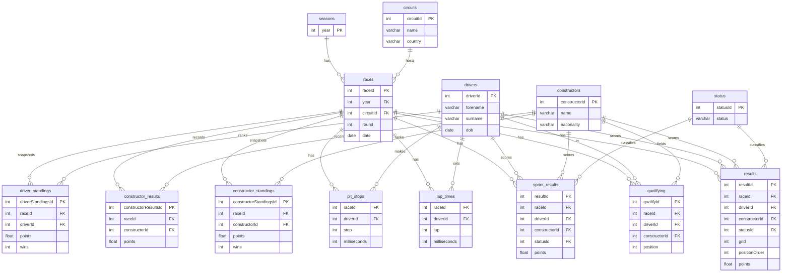

# Entity Relationship Diagram

A rendered image is in [`erd_diagram.png`](erd_diagram.png). The Mermaid version below renders
automatically on GitHub. All 23 foreign keys match `01_schema.sql`.

```mermaid
erDiagram
    seasons     ||--o{ races : has
    circuits    ||--o{ races : hosts
    races       ||--o{ qualifying : has
    drivers     ||--o{ qualifying : in
    constructors||--o{ qualifying : fields
    races       ||--o{ lap_times : has
    drivers     ||--o{ lap_times : sets
    races       ||--o{ pit_stops : has
    drivers     ||--o{ pit_stops : makes
    races       ||--o{ results : has
    drivers     ||--o{ results : scores
    constructors||--o{ results : scores
    status      ||--o{ results : classifies
    races       ||--o{ sprint_results : has
    drivers     ||--o{ sprint_results : scores
    constructors||--o{ sprint_results : scores
    status      ||--o{ sprint_results : classifies
    races       ||--o{ driver_standings : snapshots
    drivers     ||--o{ driver_standings : ranks
    races       ||--o{ constructor_standings : snapshots
    constructors||--o{ constructor_standings : ranks
    races       ||--o{ constructor_results : records
    constructors||--o{ constructor_results : records

    seasons { int year PK }
    circuits { int circuitId PK
               varchar name
               varchar country }
    constructors { int constructorId PK
                   varchar name
                   varchar nationality }
    drivers { int driverId PK
              varchar forename
              varchar surname
              date dob }
    status { int statusId PK
             varchar status }
    races { int raceId PK
            int year FK
            int circuitId FK
            int round
            date date }
    qualifying { int qualifyId PK
                 int raceId FK
                 int driverId FK
                 int constructorId FK
                 int position }
    lap_times { int raceId FK
                int driverId FK
                int lap
                int milliseconds }
    pit_stops { int raceId FK
                int driverId FK
                int stop
                int milliseconds }
    results { int resultId PK
              int raceId FK
              int driverId FK
              int constructorId FK
              int statusId FK
              int grid
              int positionOrder
              float points }
    sprint_results { int resultId PK
                     int raceId FK
                     int driverId FK
                     int constructorId FK
                     int statusId FK
                     float points }
    driver_standings { int driverStandingsId PK
                       int raceId FK
                       int driverId FK
                       float points
                       int wins }
    constructor_standings { int constructorStandingsId PK
                            int raceId FK
                            int constructorId FK
                            float points
                            int wins }
    constructor_results { int constructorResultsId PK
                          int raceId FK
                          int constructorId FK
                          float points }
```
